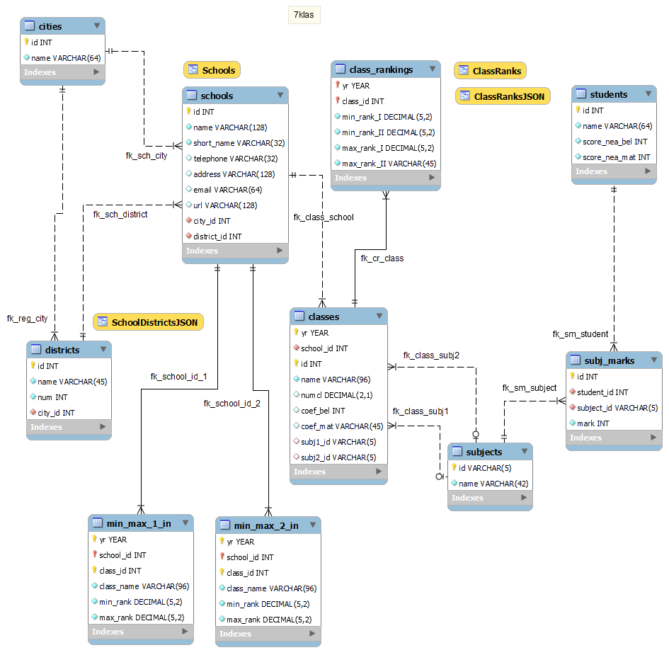

# 7 Klas

A database with information about schools and classes for application after
7-th grade with class rankings. A single-page web application in [Vue.js](https://vuejs.org/)
allowing ranking of students based on information about their NEA (National
External Assessment) results and marks to calculate student's rank. The ranking
is done compared to the minimal class ranks from previous years' campaigns.
The application could be rendered with [Bootstrap 3](https://getbootstrap.com/docs/3.4/),
[Bootstrap 4](https://getbootstrap.com/docs/4.6/getting-started/introduction/)
and [Bootstrap 5](https://getbootstrap.com/docs/5.3/getting-started/introduction/)
thus showcasing use of alternative styles on the same page.

# Database model

# Requirements

The database is designed for and requires [MySQL](https://www.mysql.com/) 5.7
or higher. The web application requires [Vue.js](https://vuejs.org/) 3
or newer and optionally [Bootstrap](https://getbootstrap.com/) 3 or newer.
